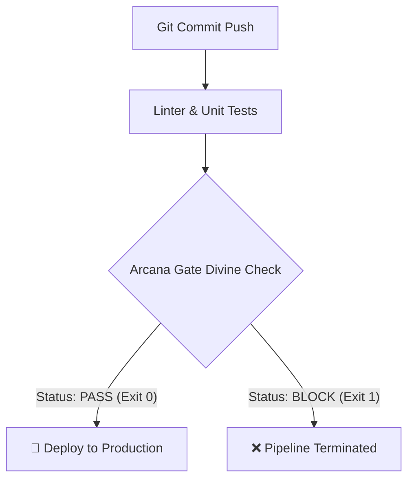

# 🔮 Arcana Gate
[](https://github.com/RewithSolo/arcana-gate/actions/workflows/pipeline.yml)
[](https://goreportcard.com/report/github.com/RewithSolo/arcana-gate)
[](https://opensource.org/licenses/MIT)
[](https://go.dev/)
> **Arcana Gate** is a deterministic, fate-driven quality gate CLI tool and native GitHub Action. It delegates deployment decisions to Tarot Major Arcana, turning release engineering into an art of divine intervention.
---
## 🎭 The Core Concept & Irony
In modern DevOps, engineering teams spend hundreds of hours configuring static analyzers, flaky e2e tests, and canary rollouts. **Arcana Gate** introduces the ultimate release circuit breaker: **let higher powers decide if your code belongs in production.**
By placing `arcana-gate` right before your deployment step, your pipeline stops being just a build script—it becomes a divine trial. If the cards foretell an architectural disaster (e.g., drawing *The Tower*), the gate exits with code `1`, instantly halting the pipeline and saving production from doomed software.


## 🎲 Math Over Magic: Absolute Determinism
Despite its mystical premise, arcana-gate is built on **strict cryptographic engineering**:
 * **SHA-256 Seeded Engine:** By hashing your commit SHA ($GITHUB_SHA or $CI_COMMIT_SHA), the exact same commit will **always draw the same card and orientation** across any runner or execution.
 * **Zero Flaky Divination:** Re-running a failed workflow step for the same commit will **never** produce a different outcome. Fate is sealed the moment code is pushed to Git.
## ✨ Key Benefits
 * 🛡 **Pipeline-First Architecture:** Engineered explicitly to act as a blocking quality gate (exit 0 / exit 1) in GitHub Actions, GitLab CI, and Jenkins.
 * 📊 **Native GitHub Step Summaries:** Automatically generates visual Markdown reports directly inside the GitHub Actions workflow UI.
 * 🔒 **DevSecOps Hardened:** Built as a static Go binary inside Google's **Distroless** base image (gcr.io/distroless/static-debian12), featuring non-root execution, SAST scans (gosec, govulncheck), and zero container vulnerabilities (trivy).
 * ⚡ **Sub-Millisecond Execution:** Standard-library-first Go core with zero external runtime dependencies.
 * ⚙️ **Strict Mode:** Option to automatically reject releases on *any* reversed card draw (--strict).
## 🚀 Pipeline Integration Guide (Primary Usage)
arcana-gate shines brightest as a blocking barrier in your deployment workflows.
### 1. GitHub Actions (Marketplace Style)
Add arcana-gate directly into your .github/workflows/deploy.yml:
```yaml
name: Production Release Pipeline
on:
  push:
    branches: [ main ]
jobs:
  arcana-gate-check:
    name: Consult Arcana Gate
    runs-on: ubuntu-latest
    steps:
      - name: Checkout Code
        uses: actions/checkout@v4
      - name: Consult Arcana Gate
        uses: RewithSolo/arcana-gate@v1
        with:
          seed: ${{ github.sha }}
          strict: 'false'
  deploy:
    name: Deploy to Kubernetes
    needs: arcana-gate-check # Runs ONLY if Arcana Gate returns exit code 0
    runs-on: ubuntu-latest
    steps:
      - name: Execute Deployment
        run: echo "Fate allowed this release. Deploying..."
```
### 2. Generic Docker Pipeline (GitLab CI / Woodpecker)
```yaml
# Example for GitLab CI (.gitlab-ci.yml)
arcana_gate_job:
  stage: test
  image: ghcr.io/rewithsolo/arcana-gate:latest
  script:
    - /arcana-gate --seed=$CI_COMMIT_SHA
```
## 💻 Local CLI Usage Guide
You can also execute arcana-gate locally for testing or shell-based deployment automation.
```bash
# Build the static binary
go build -o arcana-gate ./cmd/arcana-gate
# Execute with an auto-generated runtime seed
./arcana-gate
# Test deterministic outcome for a specific commit hash
./arcana-gate -seed="c8f13b90a82b45e"
# Execute in strict mode (blocks on reversed cards)
./arcana-gate -seed="c8f13b90a82b45e" -strict
# Inspect exit code (0 = PASS, 1 = BLOCK)
echo $?
```
## 🔮 Major Arcana Decision Matrix

| Card | Upright Verdict | Reversed Verdict | CI/CD Meaning & Impact |
| :--- | :--- | :--- | :--- |
| **The Tower** | ❌ BLOCK | ❌ BLOCK | **Catastrophic Failure.** High probability of production outages, kernel panics, and data corruption. |
| **Death** | ❌ BLOCK | ✅ PASS | **Architectural Transformation.** Upright indicates breaking schema changes; Reversed signifies successful migration. |
| **The Devil** | ❌ BLOCK | ❌ BLOCK | **Technical Debt Overload.** Hardcoded credentials, unmaintainable hacks, or licensing breaches detected. |
| **The Sun** | ✅ PASS | ✅ PASS | **Flawless Release.** Zero latency spikes, 100% test coverage, and complete system harmony. |
| **The World** | ✅ PASS | ✅ PASS | **Microservice Synergy.** Green telemetry across all Kubernetes pods and service meshes. |
| **The Fool** | ✅ PASS | ❌ BLOCK | **YOLO Deploy.** Upright represents bold innovation; Reversed warns against untested Friday evening releases. |

## 🛠 Project Layout & Architecture
Designed in accordance with **Standard Go Project Layout** and Clean Architecture principles:
```text
arcana-gate/
├── .github/
│   └── workflows/
│       └── pipeline.yml       # Unified CI/CD (Lint, Tests, SAST, Trivy, GoReleaser)
├── cmd/
│   └── arcana-gate/           # CLI Application Entrypoint & OS Exit Code Handler
├── internal/
│   ├── config/                # Environment & CLI flag parser hierarchy
│   ├── domain/                # Core domain models (Card, GateResult, Oracle interface)
│   ├── engine/                # SHA-256 deterministic decision engine & deck definitions
│   └── presenter/             # ANSI Terminal & GitHub Markdown step summary presenters
├── action.yml                 # GitHub Action Marketplace metadata manifest
├── Dockerfile                 # Distroless multi-stage container build
└── .goreleaser.yml            # Multi-architecture release cross-compiler
```
## 🛡 Security & Quality Standard
This repository enforces enterprise-grade DevSecOps controls on every commit:
 * **Static Analysis:** golangci-lint (v1.57) & gosec SAST security scanner.
 * **Vulnerability Audit:** Official Go govulncheck & Aqua Security Trivy container image scanner.
 * **Concurrency Safety:** Unit tests executed with -race detector enabled.
 * **Coverage Threshold:** Pipeline fails automatically if total code coverage falls below 80%.
## 📜 License
This project is open-source software licensed under the MIT License.
